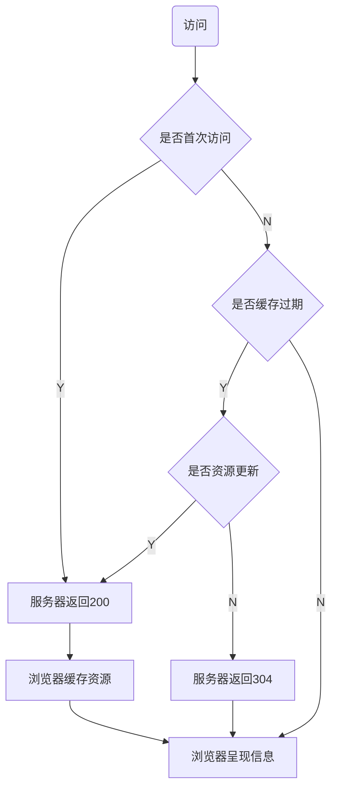

# Cache-Control

## max-age=n

| 访问次数       | 服务端                                             | 浏览器                     |
| -------------- | -------------------------------------------------- | -------------------------- |
| 首次访问       | 返回200                                | 缓存本地，过期时间`n`秒    |
| 过期前，再访问 | -                                                  |读缓存，不请求服务器 |
| 过期后，再访问 | 资源更新，返回资源，状态码200；资源未更新，返回304 |  304：读缓存                        |

