文档：https://mermaid.js.org/intro/getting-started.html

# 流程图

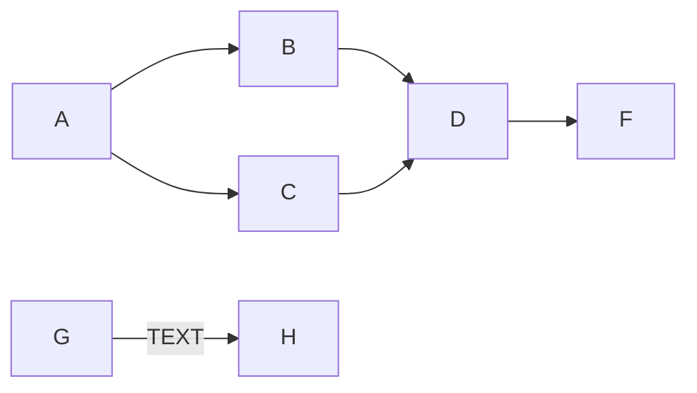

```
graph LR

%% Comment

A --> B
B --> D


A --> C
C --> D

D --> F

G --> | TEXT | H
```

# 时序图

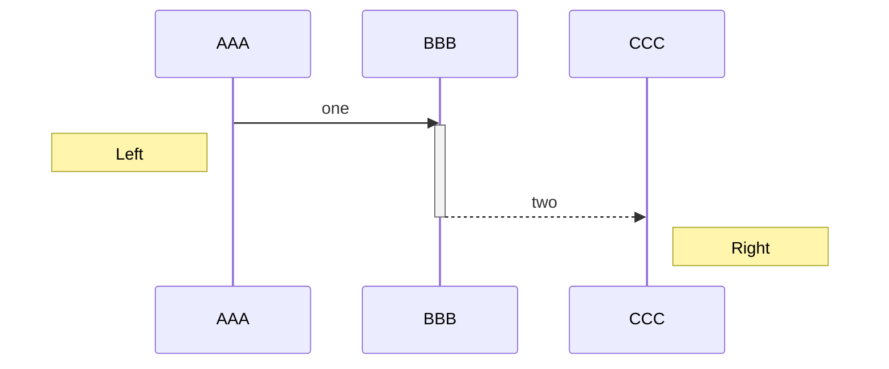

```
sequenceDiagram

%% Comment

participant a as AAA
participant b as BBB
participant c as CCC

%% solid line
a->>b: one
  activate b
  note left of a: Left

%% Dotted line
b-->>c: two
  activate c
  deactivate b
  note right of c: Right
```

# 甘特图

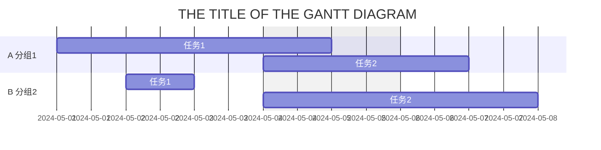

```
gantt

%% Comment

dateFormat  YYYY-MM-DD
title       THE TITLE OF THE GANTT DIAGRAM
excludes    weekends

section A 分组1
  任务1: 2024-05-01, 2024-05-05
  任务2: 2024-05-04, 2d
section B 分组2
  任务1: 2024-05-02, 2024-05-03
  任务2: 2024-05-04, 3d
```

---

# Flowcharts

## Orientation

- TD: Top-Down
- LR: Left to Right

## Shapes

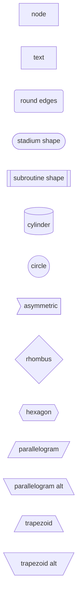

## Links

### Type

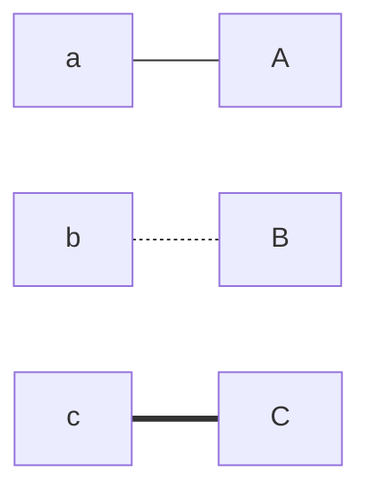

### Arrow

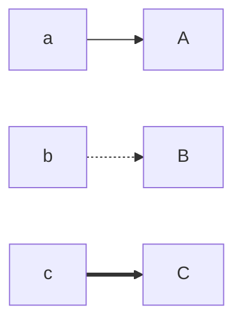

### Text

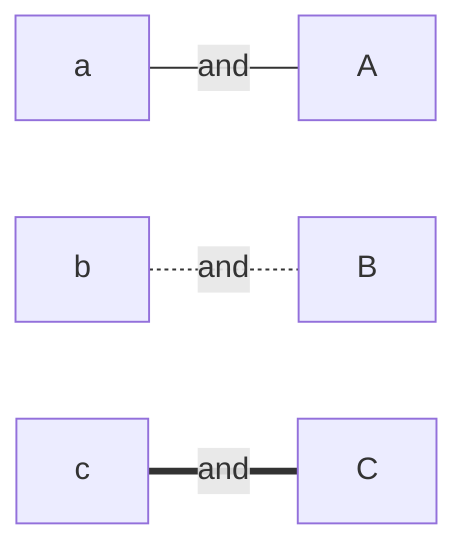
### Connection

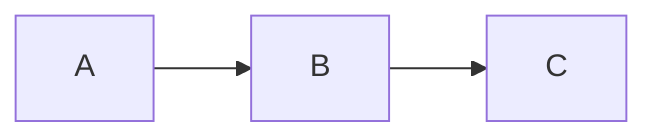

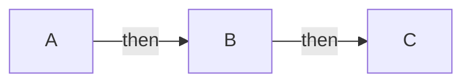

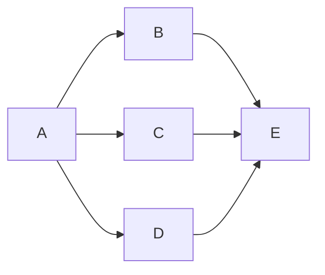


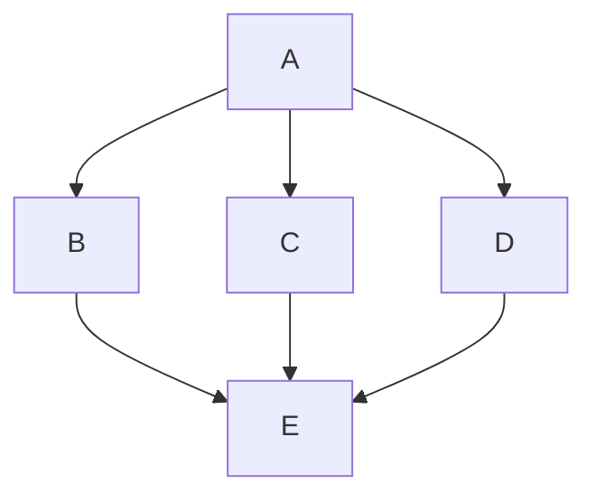

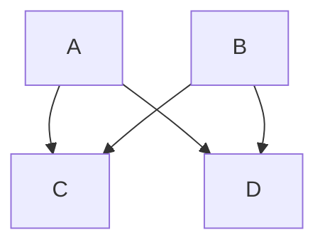

# Sequence diagrams

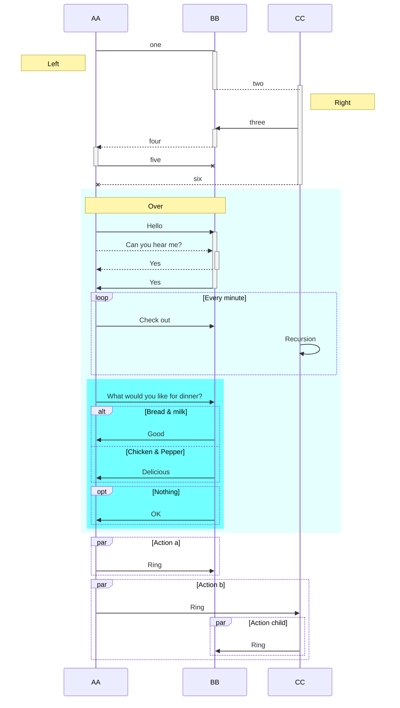

```
sequenceDiagram
    participant a as AA
    participant b as BB
    participant c as CC
    
    %% solid line
    a->b: one
    activate b
    Note left of a: Left
    
    %% Dotted line
    b-->c: two
    activate c
    deactivate b
    Note right of c: Right
    
    %% Solid line with arrowhead
    c->>b: three
    activate b
    
    %% Dotted line with arrowhead
    b-->>a: four
    activate a
    deactivate b
  
    %% Solid line with a cross (async)
    a-xb: five
    deactivate a

    %% Dotted line with a cross (async)
    c--xa: six
    deactivate c
  
  	%% Background
    rect rgba(0, 255, 255, .1)
        Note over a, b: Over
        a->>b: Hello
        activate b
        a-->>b: Can you hear me?
        activate b
        b-->>a: Yes
        deactivate b
        b->>a: Yes
        deactivate b

        %% Loop
        loop Every minute
          a->>b: Check out
          c->>c: Recursion
        end
        rect rgba(0, 255, 255, .5)
          %% Alternative & Optional
          a->>b: What would you like for dinner?
          alt Bread & milk
              b->>a: Good
          else Chicken & Pepper
              b->>a: Delicious
          end

          opt Nothing
              b->>a: OK
          end
        end
    end
  	
  	%% Parallel
  	par Action a
  		a->>b: Ring
  	end
  	par Action b
  		a->>c: Ring
  			par Action child
  			c->>b: Ring
  		end
  	end
  	
```

## Note

> A note on nodes, the word "end" could potentially break the diagram, due to the way that the mermaid language is scripted.
>
> If unavoidable, one must use parentheses(), quotation marks "", or brackets {},[], to enclose the word "end". i.e : (end), [end], {end}.

# Pie chart diagrams

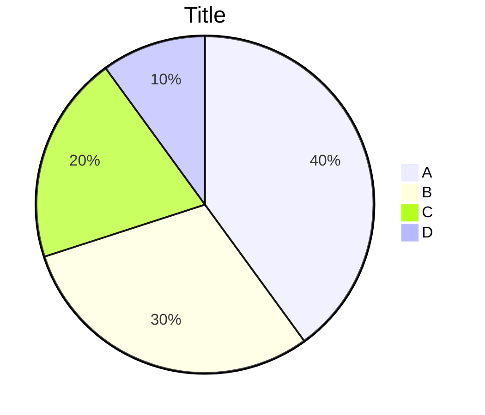

```
pie
  title Title
  "A" : 40
  "B" : 30
  "C" : 20
  "D" : 10
```

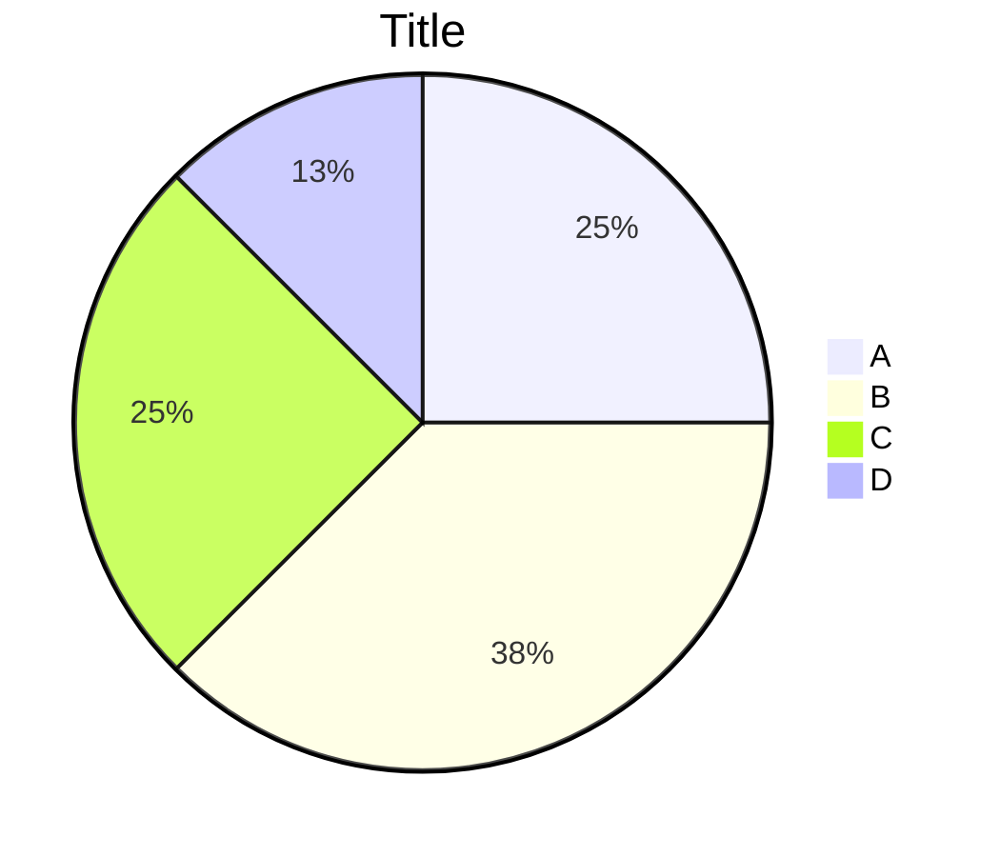
```
pie
  %% 总数非100时，会按比例折算
  title Title
  "A" : 20
  "B" : 30
  "C" : 20
  "D" : 10
```

# Gantt diagrams

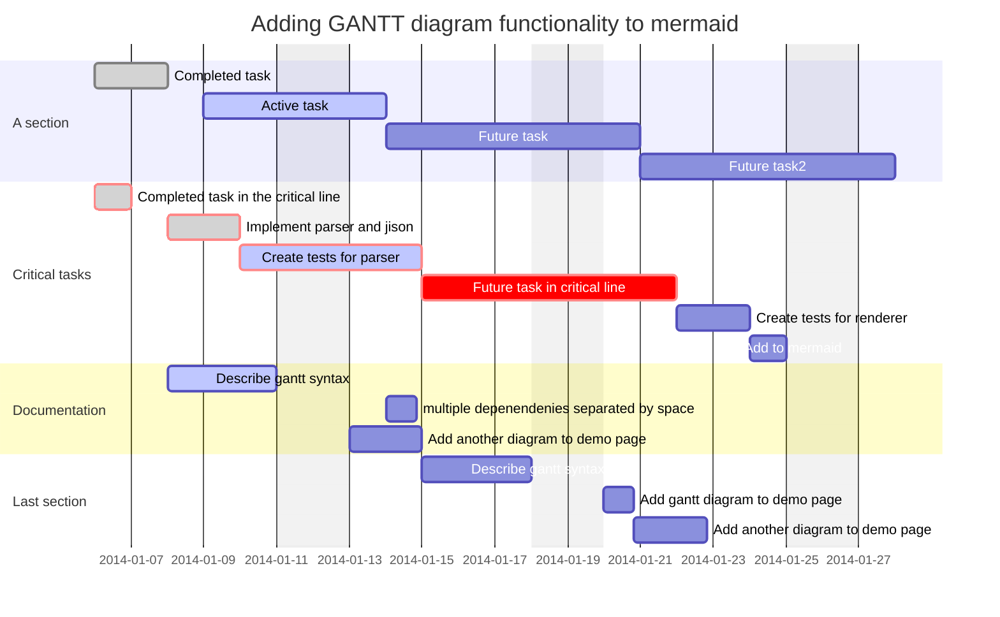

```
gantt
    %% Comment
    dateFormat  YYYY-MM-DD
    title       Adding GANTT diagram functionality to mermaid
    excludes    weekends

    section A section
    Completed task            :done,    des1, 2014-01-06,2014-01-08
    Active task               :active,  des2, 2014-01-09, 3d
    Future task               :         des3, after des2, 5d
    Future task2              :         des4, after des3, 5d

    section Critical tasks
    Completed task in the critical line :crit, done, 2014-01-06,24h
    Implement parser and jison          :crit, done, after des1, 2d
    Create tests for parser             :crit, active, 3d
    Future task in critical line        :crit, 5d
    Create tests for renderer           :2d
    Add to mermaid                      :1d

    section Documentation
    Describe gantt syntax               :active, a1, after des1, 3d
    multiple depenendenies separated by space      :after a1, after des2 doc1, 20h
    Add another diagram to demo page    :doc1, after a1  , 48h

    section Last section
    Describe gantt syntax               :after doc1, 3d
    Add gantt diagram to demo page      :20h
    Add another diagram to demo page    :48h
```

## Today marker

```
todayMarker stroke-width:5px,stroke:#0f0,opacity:0.5
```

```
todayMarker off
```